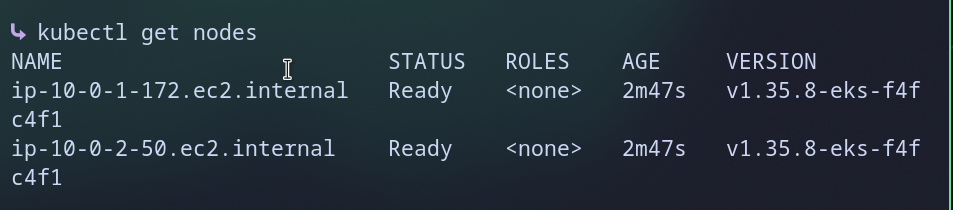

# 01 - Terraform Foundation

Builds the AWS base for Robot Shop using Terraform. One command creates everything.

## What it creates (15 resources)

- 1 VPC with 2 public subnets in 2 zones
- 1 Internet Gateway and 1 route table
- 2 IAM roles (cluster and nodes) with 4 policies
- 1 EKS cluster (Kubernetes 1.35)
- 1 node group: 2 x t3.small servers

## Files

| File | Purpose |
|------|---------|
| `providers.tf` | AWS provider and region (us-east-1) |
| `variables.tf` | Inputs: names, network ranges, zones |
| `main.tf` | All the resources |
| `outputs.tf` | Cluster name, endpoint, VPC and subnet IDs |

## How to run

```bash
terraform init
terraform plan
terraform apply
aws eks update-kubeconfig --region us-east-1 --name robotshop-cluster
kubectl get nodes
```

## Result

Both nodes show `Ready`.



## Design choices

- **Public subnets only:** no NAT Gateway, so no extra hourly cost.
- **Terraform runs locally** with AWS CLI credentials. State stays on my laptop.
- **Destroy after each session** with `terraform destroy` to control cost.

## Known simplification

The cluster API is open to the internet. Fine for a short demo. A real setup would lock it down.
