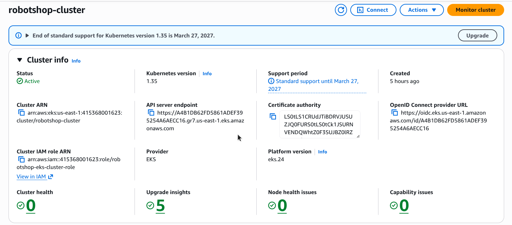
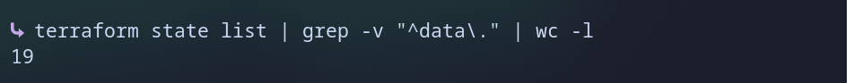

# 01 - Terraform Foundation

Builds the AWS base for Robot Shop using Terraform. One command creates everything.

## What it creates (19 resources)

- 1 VPC with 2 public subnets in 2 zones
- 1 Internet Gateway, 1 route table and 2 route table links
- 2 IAM roles (cluster and nodes) with 4 policies
- 1 EKS cluster (Kubernetes 1.35)
- 1 node group: 2 x m7i-flex.large servers
- EBS storage driver addon, with its own IAM role (OIDC provider, role and policy)

## Files

| File | Purpose |
|------|---------|
| `providers.tf` | AWS and TLS providers, region us-east-1 |
| `variables.tf` | Inputs: names, network ranges, zones |
| `main.tf` | All the resources |
| `outputs.tf` | Cluster name, endpoint, VPC and subnet IDs |

## How to run

**Important:** on a fresh cluster, run this ONE command before the first `terraform apply` with access entries in it, or it will fail:
```bash
aws eks update-cluster-config --name robotshop-cluster --region us-east-1 --access-config authenticationMode=API_AND_CONFIG_MAP
```
This cannot be put inside Terraform without forcing a full cluster rebuild, so it has to be run manually every time the cluster is recreated from scratch.

```bash
terraform init
terraform plan
terraform apply
aws eks update-kubeconfig --region us-east-1 --name robotshop-cluster
kubectl get nodes
```

## Result

The cluster is active and both nodes are `Ready`.





## Design choices

- **Public subnets only:** no NAT Gateway, so no extra hourly cost.
- **Terraform runs locally** with AWS CLI credentials. State stays on my laptop.
- **Destroy after each session** with `terraform destroy` to control cost.
- **Own IAM role for the storage driver:** the driver gets only the permission it needs.

## Known simplification

The cluster API is open to the internet. Fine for a short demo. A real setup would lock it down.
