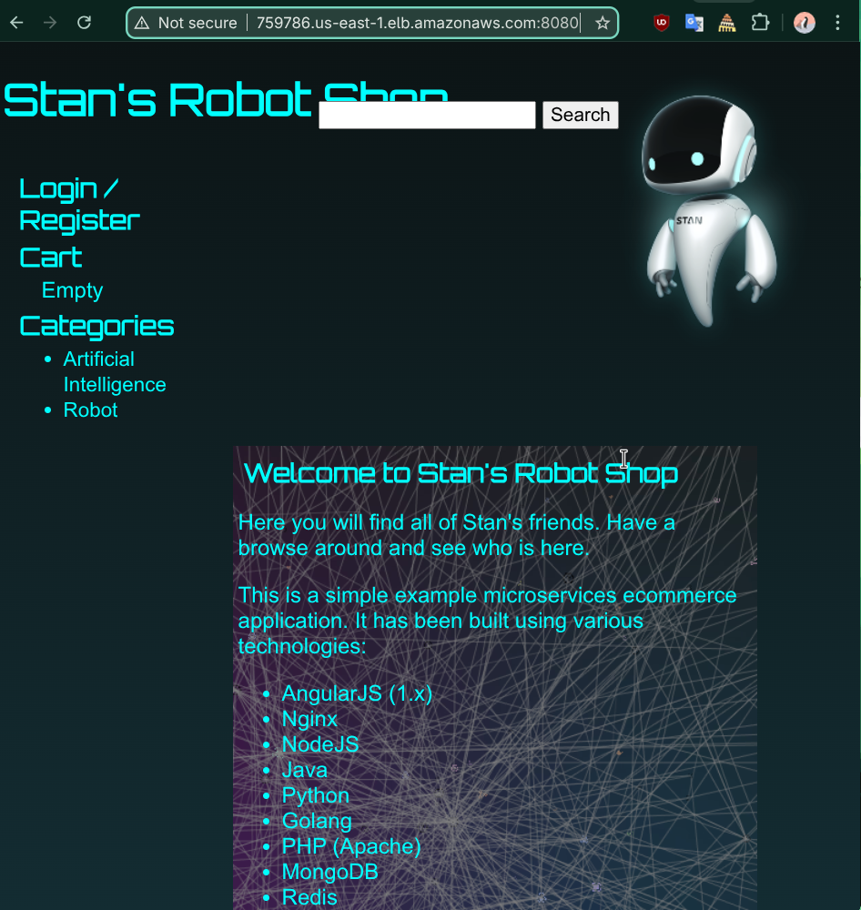
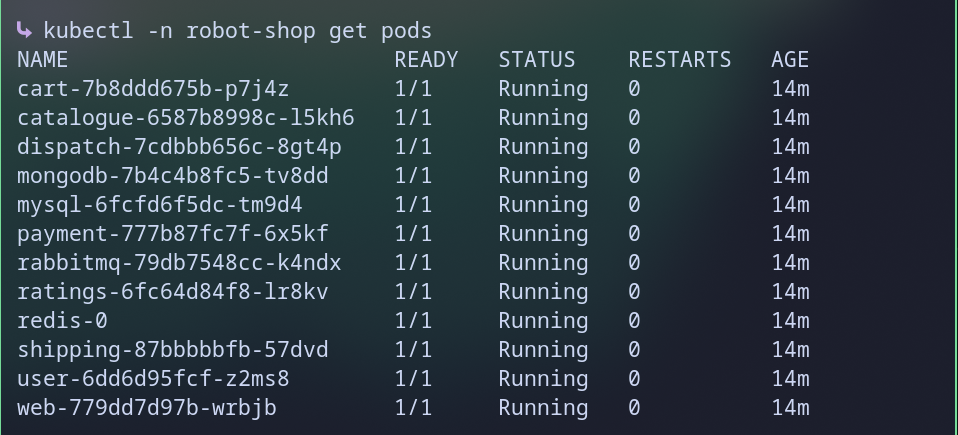
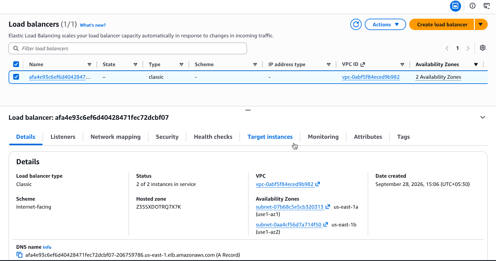

# 02 - Robot Shop on EKS

(Note: this is now managed by Terraform in 01-terraform-foundation, kept here for history.)

Runs Robot Shop (12 pods) on the EKS cluster and opens it to the internet with an AWS load balancer.

## Files

| File | Purpose |
|------|---------|
| `storageclass.yaml` | Storage class `standard` for Redis, using the EBS driver |
| `metrics-server.yaml` | Gives CPU and memory numbers, needed for autoscaling later |
| `pods.txt` | Pod list after deploy |

## Steps

```bash
# connect kubectl to the cluster
aws eks update-kubeconfig --region us-east-1 --name robotshop-cluster

# storage class and metrics-server
kubectl apply -f storageclass.yaml
kubectl apply -f metrics-server.yaml

# get the official Robot Shop chart and install it
git clone https://github.com/instana/robot-shop.git
kubectl create namespace robot-shop
helm install robot-shop robot-shop/K8s/helm --namespace robot-shop

# get the public address
kubectl -n robot-shop get svc web
```

Open `http://<EXTERNAL-IP>:8080` in a browser.

## Result

All 12 pods are `Running`. The `web` service got a public AWS load balancer.









## Problems and fixes

| Problem | Cause | Fix |
|---------|-------|-----|
| Redis stuck `Pending` | No `standard` storage class and no EBS driver | Added `storageclass.yaml` and the EBS CSI addon in Terraform |
| EBS driver kept crashing | Pod could not get AWS permissions from the node | Gave the driver its own IAM role (IRSA) |
| MySQL stuck `Pending` | `t3.small` nodes ran out of memory and pod slots | Moved to `m7i-flex.large` nodes |
| Bigger nodes would not start | The free plan blocks some instance types | Picked a type from the free-tier list |

## Tear down

Do these steps in order, before `terraform destroy`:

```bash
helm uninstall robot-shop -n robot-shop
kubectl -n robot-shop delete pvc data-redis-0
kubectl -n robot-shop get svc,pvc
```

The last command should show nothing. Then run `terraform destroy` in `01-terraform-foundation/`.

The load balancer and the Redis disk are created by Kubernetes, not Terraform. If they are left behind, they keep costing money.
