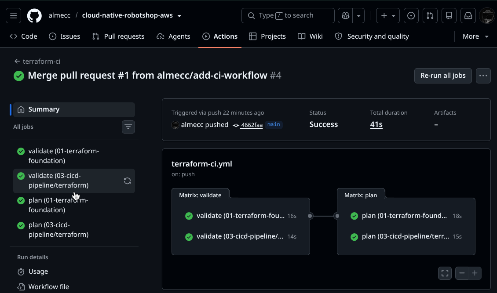
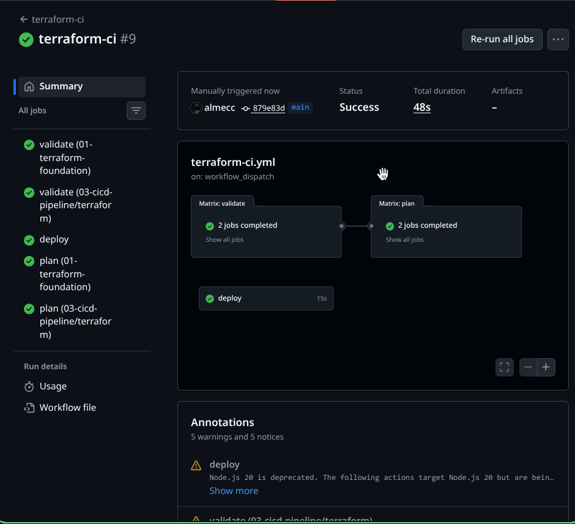

# 03 - CI/CD Pipeline

Checks and plans the Terraform code automatically using GitHub Actions, with no AWS keys stored in GitHub.

## What it does

- Runs on every pull request and every push to `main` that touches Terraform files
- Checks code formatting (`terraform fmt`)
- Checks the code is valid (`terraform validate`)
- Shows what would change (`terraform plan`) for both Terraform folders
- Logs in to AWS using OIDC (a short-lived key per run, nothing stored)

## Files

| File | Purpose |
|------|---------|
| `terraform/` | Creates the AWS role GitHub Actions uses to log in |
| `../.github/workflows/terraform-ci.yml` | The pipeline itself |

## How the AWS login works

1. GitHub issues a short-lived identity token for the workflow run
2. AWS checks that token against a trust rule (only this repo can use it)
3. AWS hands back a temporary key, valid only for that run
4. No access key or secret is ever saved in GitHub

## Result

All four jobs pass on a pull request.

## Problem and fix

GitHub changed how it identifies repositories in these tokens partway through this project (uses a new format with extra ID numbers). The trust rule I wrote used the old format, so every login was rejected. Fixed by decoding a real token from the pipeline logs to see the actual value, then matching the trust rule to it.

The plan job could not read the Redis StorageClass. The read-only role had AWS-level permission but was never registered inside the cluster itself. Added a scoped EKS access entry and Kubernetes RBAC group for the plan role.

RBAC binding used the wrong subject type at first. IAM role sessions map to a templated username, not a fixed one, so binding to a "User" does not work reliably. Bound the ClusterRole to a Kubernetes Group instead, set via the access entry's `kubernetes_groups`.
## Not yet automatic

The pipeline only checks and plans. It does not deploy Robot Shop yet, since that needs a cluster that isn't always running. Deploy is a manual step for now.

## Deploy job (manual)

A separate `deploy` job, triggered only by clicking "Run workflow" on GitHub, connects to the cluster and runs `helm upgrade --install`. It does not run automatically, since the cluster is not always on.

The deploy role can only edit things inside an existing namespace, not create new ones. This is on purpose - the pipeline should not have more power than it needs. The `robot-shop` namespace is created once by hand when the cluster is rebuilt.

